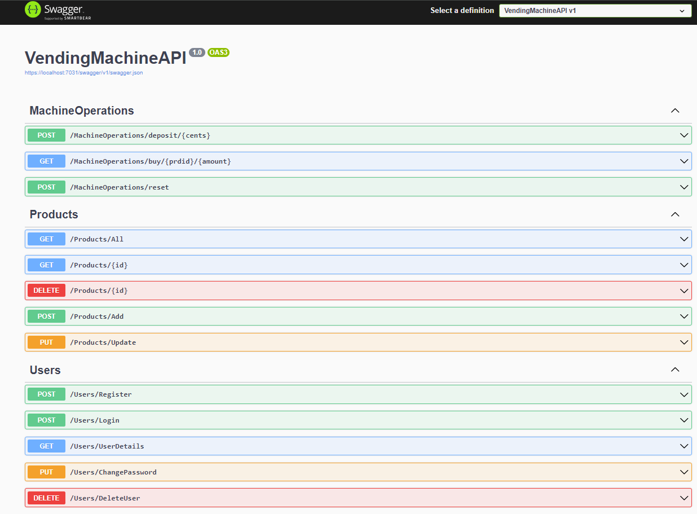
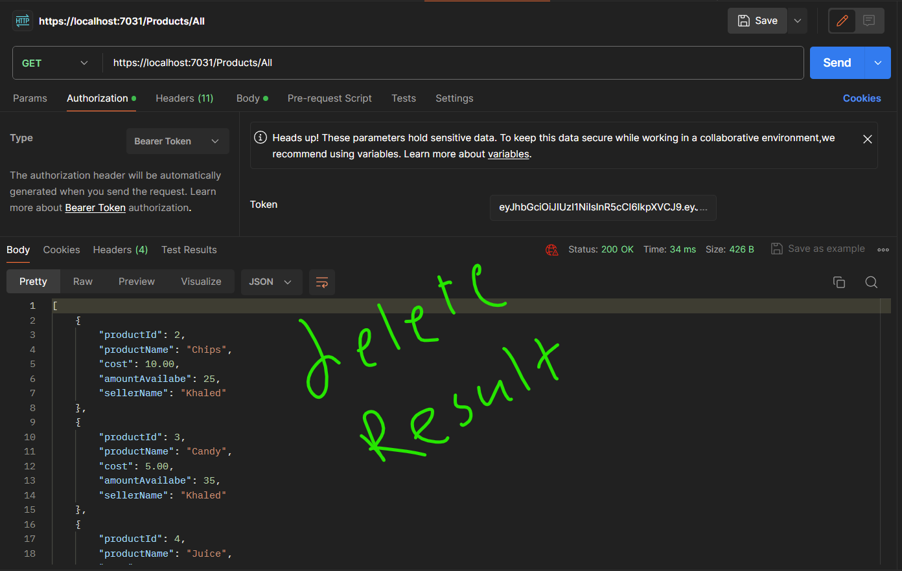

# FlapKap's Backend challenge
designing and building an API for a vending machine, allowing users with a “seller” role to add, update or remove products, while users with a “buyer” role can deposit coins into the machine and make purchases. Your vending machine should only accept 5, 10, 20, 50 and 100 cent coins. Applying Authentecation & Authorization using JWT.

# Table Of Contents

- [A quick overview of the API endpoints](#A-quick-overview-of-the-API-endpoints)

- [Security (Authentication/Authorization) using JWT](#Security(Authentication/Authorization)-using-JWT)

- [How to run the API](#How-to-run-the-API)

- [How to use the system and API tests for all implemented endpoints](#How-to-use-the-system-and-API-tests-for-all-implemented-endpoints)

- [Logging using SeriLog](#Logging-using-SeriLog)

#  A quick overview of the API endpoints

### In the API I have build 3 Controllers:
- <b>UsersController</b> => Having the Following endpoints:
 - <b>/Register</b> -> this endpoint takes the registration data from the client and validates it and then it creates a new user and gives that user a role ("buyer", "seller").
 - <b>/Login</b> -> this endpoint takes the Login data from the client and checks if that user already exists and then it creates a JWT and sends it back to the client so he/she can access the system with the allowed authorizations according to his/her role.
 - <b>/UserDetails</b> -> Allow Authenticated users to see their details.
 - <b>/ChangePassword</b> -> Allow Authenticated users to change their password.
 - <b>/DeleteUser</b> -> Allow Authenticated users to delete their acounts from the system.

- <b>ProductsController</b> => Having the Following endpoints:
 - <b>/All</b> -> Allow All Authenticated users to show all the products.
 - <b>/{id} with GET Method</b> -> Allow All Authenticated users to show a specific product accoding to its Id.
 - <b>/Add</b> -> Allow All Authenticated users with role "seller" to Add new products.
 - <b>/{id} with Delete Method</b> -> Allow All Authenticated users with role "seller" to delete only their products.
 - <b>/Update</b> -> Allow All Authenticated users with role "seller" to Update only their products.

- <b>MachineOperationsController</b> => Having the Following endpoints:
 - <b>/deposit</b> -> Allow All Authenticated users with a “buyer” role to deposit 5, 10, 20, 50 and 100 cent coins into their vending machine account.
 - <b>/buy</b> -> Allow All Authenticated users with a “buyer” role to buy products with the money they’ve deposited. API returns the total they’ve spent, products they’ve purchased and their change if there’s any (in 5, 10, 20, 50 and 100 cent coins).
 - <b>/reset</b> -> Allow All Authenticated users with a “buyer” role to reset their deposit.

#### And here's a photo to clarify all the endpoints from Swagger
 

#  Security (Authentication/Authorization) using JWT

In order to secure the API I have used JWT (JSON Web Token).

in order to use the API you have to be authenticated so first you have to register your account and then login to get your token that makes you authenticated and authorized to the system.

#  How to run the API
#### Prerequisites:
- Download and Install .Net 8 
- Download and Install Visual Studio or any other IDE that supports ASP.Net Core Applications.
- Download and Install Microsoft SQL Server.

#### Runnig the API:
- Clone the project to your local machine.
- Attach the database files to your MS SQL Server, you will find these files with the cloned project in the database directory.
- Now you can open the project from Visual Studio and run it on your local machine.

In the next section, we will see how to use the API and all the API tests for the implemented endpoints.

#  How to use the system and API tests for all implemented endpoints

As I said before, in order to use the system you have to be registered in the system and also authenticated.
  Let's see how this works and how all the endpoints work.

- Here in the following image, we are trying to access an endpoint without being authenticated, and as you can see the system prevents me from accessing the system endpoints.
 

- In the following images, we have registered a new user to the system successfully. In the order to register a new user you have to send all the required data in the body as you see in the image. 
 
 

- In the following images, some tests for failed registration.
 
 
 

- After we have registered our accounts successfully, now we can get our JWT and its expiration date by logging into our accounts as follows.
***Hint***: Every token is valid for one hour, after that, you can generate a new token by log in again.
 
 

- Faild Login:
 

- Now, after we get our token we are now authenticated to use the system and authorized to do some actions according to our role by sending our token in every request to the API as follows. In the following images we can see our account details. Every user has the right to see his only details only.
 
 

- Sampels for changing password enpoint:
 
 

- Deleting user: Every user has the right to delete his account only.
 
  If we try to login again
 

### Now, let's see all possible tests on our productsController endpoints.
To check all the possible tests we will have 2 users in our system:
  Khaled with role "seller"
  Azza with role "buyer"

- Adding new products, the "seller" role only has the right to add products. In the following images as we can see only the "seller" can add products.
 
 

- All the Users ("seller" or "buyer") have the right to show (GET) all the products or a specific product.
 
 

- deleting products, the "seller" role only has the right to delete his products only.
 
 
 

- Updating products, the "seller" role only has the right to Update his products only.
 
 

### Now, let's see all possible tests on the buyer operations in MachineOperationsController endpoints.
All the endpoints in this controller are authorized by the "buyer" role only.

- deposite endpoint tests:
 
 
 
 

- buy endpoint tests:
 
 

- reset endpoint tests:
 

#  Logging using SeriLog

I have used SeriLog For logging some information about the system: 

 
 
 
 